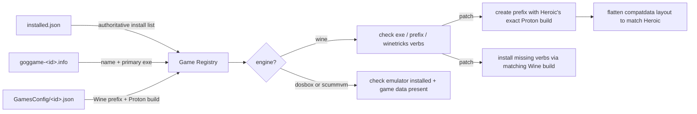

# GOG Companion for Heroic

**A single bash script that reverse-engineers how Heroic actually runs your
GOG games — then fixes the ones that are broken, automatically.**

Not "install some packages and hope." This script reads Heroic's own
`GamesConfig`, matches the *exact* Proton build it configured per game,
replicates Heroic's on-disk prefix layout byte-for-byte, and works around
three separate real-world Wine/Winetricks/Flatpak bugs it took actual
reverse-engineering to find (see [below](#under-the-hood)). If you've ever
wondered *why* winetricks silently does nothing on your Proton prefix, or why
Flathub randomly throws `GPG verification enabled, but no summary found` —
you'll want to read that section.

It's built to be the companion the [Heroic Games
Launcher](https://heroicgameslauncher.com/) doesn't ship with: a CLI that
knows what's installed, what's ready, and what to run next.

## What it does

1. **System setup** — installs Wine, Winetricks, DOSBox, ScummVM, 32-bit
   graphics/audio libraries, Flatpak/Flathub, Heroic/Lutris, ProtonUp-Qt, and
   `cnc-ddraw` for the classic DirectDraw black-screen bug.
2. **Game registry & doctor** — scans your GOG install directory, cross
   references Heroic's own config to find each game's real Wine/Proton
   prefix, classifies each game's runtime (Wine vs. native DOSBox/ScummVM),
   and tells you exactly what's ready and what isn't.
3. **Autonomous patching** — creates missing Wine prefixes from scratch using
   the *exact* Proton build Heroic already picked, then installs missing
   redistributables into them. No manual `winecfg` fiddling.

Run against a real 52-game Heroic library, it took games from "haven't been
launched once" to fully verified and dependency-complete without touching
Heroic itself.

## Quick start

```bash
chmod +x gog-setup.sh

# First run: install everything, then scan + verify your games
./gog-setup.sh

# See what's ready and what isn't, with next-step suggestions
./gog-setup.sh list

# Auto-create missing Wine prefixes and install missing dependencies
./gog-setup.sh patch
```

## Commands

| Command  | What it does |
|----------|---------------|
| `all`    | System setup, then scan + verify your games (default when no command is given) |
| `setup`  | Install/refresh system packages, Wine, launchers and tools only |
| `scan`   | Scan the games directory and (re)build the game registry |
| `verify` | Check each registered game's executable, Wine prefix and dependencies |
| `patch`  | Scan, auto-create missing Wine prefixes, install missing dependencies, then list |
| `list`   | Print the current game registry with a colorized ready/status table + progress bar |
| `doctor` | Scan + verify + list, without touching system packages |
| `logs`   | Show the last 200 lines of the companion log |
| `help`   | Show usage |

## Options

| Option | Description |
|--------|-------------|
| `-d, --games-dir <path>` | Games directory to scan (default: `~/Games/Heroic`) |
| `-c, --heroic-config-dir <path>` | Heroic config dir (default: auto-detected — see [below](#heroic-config-auto-detection)) |
| `--only <name-or-id>` | Limit `scan`/`verify`/`patch`/`doctor` to one game (case-insensitive name substring or exact GOG id) — handy for iterating on a single broken game |
| `-y, --yes` | Non-interactive mode (assume yes / pick sensible defaults) |
| `-f, --fix` | Auto-install missing Winetricks components during `verify` |
| `-h, --help` | Show usage |

## Heroic config auto-detection

Heroic can be installed three different ways on Ubuntu, and each one puts its
config in a different place:

- **Native / AppImage** — `~/.config/heroic`
- **Flatpak** (what `setup` installs by default, and the most common way to
  get Heroic on Ubuntu) — `~/.var/app/com.heroicgameslauncher.hgl/config/heroic`
- **Snap** — `~/snap/heroic/current/.config/heroic`

Every `wine_prefix`/`runner` lookup depends on reading the *right* one of
these. Get it wrong and it's not a per-game glitch — **every** Wine-engine
game in your library reports `unknown_prefix` forever, since the script never
finds the Wine prefix or Proton build Heroic actually configured for any of
them. The script checks all three on every run and uses whichever one
actually has Heroic's GOG install list (preferring the most recently modified
if more than one is present), so this should just work — but if Heroic is
installed somewhere non-standard, override it with `-c/--heroic-config-dir`
or the `GOG_HEROIC_CONFIG_DIR` environment variable.

## Architecture



Every game is classified by **engine**, detected from its manifest's primary
launch task:

- **`wine`** — a Windows game running under Wine/Proton. Verified by
  checking the executable, the Wine prefix, and a set of common
  redistributables (`corefonts`, `vcrun2019`, `d3dx9`, `xact`, `xact_x64`).
- **`dosbox` / `scummvm`** — classic titles Heroic runs with its bundled
  emulator, never touching Wine at all. The script only checks the emulator
  binary is installed and the game data is present — trying to verify a Wine
  prefix for these produces nothing but false negatives.
- **`native`** — old-style GOG `.sh` Linux installers that pre-date the
  `goggame-<id>.info` manifest convention entirely. They ship their own
  bundled binaries (DOSBox, ScummVM or the game itself) plus a `start.sh`
  launcher, with no manifest to read at all. Detected by the presence of an
  executable `start.sh` when no manifest exists; verified by checking that
  `start.sh` is present and executable — no Wine prefix and no system
  emulator package required.

## Under the hood

This is the part that was actually fun. Getting `patch` to reliably work
required reverse-engineering sixteen independent, undocumented failure modes:

### 1. Winetricks can't find `wineserver` on Debian/Ubuntu

Debian/Ubuntu's `wine` package installs `wineserver` at
`/usr/lib/x86_64-linux-gnu/wine/wineserver` — a path that isn't in
winetricks' hardcoded search list (which only checks `.../wine/bin/wineserver`,
with a `/bin/`). Every winetricks call aborted with `warning: wineserver not
found!` and quietly did nothing. Fix: resolve the real binary ourselves and
pass it through winetricks' own `WINESERVER=` override.

### 2. Proton's `explorer.exe` deadlocks `winetricks list-installed`

`STEAM_COMPAT_DATA_PATH=... proton run wineboot --init` leaves a persistent
`explorer.exe /desktop` session running (normal Proton session behavior).
`winetricks list-installed` calls `wineserver -w` — *wait for every wine
process in this prefix to exit* — and hangs forever, because that
`explorer.exe` is designed to never exit. Fix: kill it with the matching
`wineserver -k` immediately after every prefix operation, and wrap every
winetricks/Proton call in `timeout` as defense in depth.

### 3. System Wine can't run programs inside a Proton-created prefix

Even after fixing the above, `vcrun2015` failed with `Library shlwapi.dll ...
not found` — a *real* DLL loader failure, not a config issue. Proton's
bundled Wine build populates a prefix's `system32` with its own builtin DLL
set; running the *system* wine binary against that prefix causes symbol
resolution failures because the two builds' internal DLL implementations
don't match. Fix: resolve each game's exact Proton build from Heroic's
`GamesConfig/<id>.json` and point winetricks' `WINE=` override at
`<proton_dir>/files/bin/wine` — the *same* binary Heroic itself would use.

### 4. Proton's prefix layout vs. Heroic's layout

A vanilla `proton run wineboot --init` produces
`$STEAM_COMPAT_DATA_PATH/{config_info,tracked_files,version,pfx/{drive_c,system.reg,...}}`.
Heroic's real prefixes instead have `drive_c`/`system.reg` **directly** at the
top level, with `pfx` as a self-symlink (`pfx -> .`). This was reverse
engineered by diffing a sandboxed test prefix against a real
Heroic-launched one, byte for byte. `init_wine_prefix()` replicates the
flattening step so a script-created prefix is indistinguishable from one
Heroic created itself.

### 5. Flathub's summary/GPG errors

A `flathub` remote added with the wrong URL (`https://flathub.org` instead of
the real repo `https://dl.flathub.org/repo/`) or missing its GPG key makes
`remote-add --if-not-exists` silently keep the broken config forever —
`flatpak install` then fails with `GPG verification enabled, but no summary
found`, crashing the whole script under `set -e`. Fix: verify the remote
actually resolves a single-branch ref (`com.heroicgameslauncher.hgl` — using
`org.freedesktop.Platform` here gives a false negative since it has multiple
branches), and if not, `remote-delete --force` + re-add from the official
`.flatpakrepo` bootstrap.

### 6. Killing wineserver too eagerly causes its own race

The fix for #2 (kill wineserver after a prefix operation) initially ran after
*every single* winetricks call, not just prefix creation. That forced a
wineserver cold-start on almost every verb, and its startup banner
(`wineserver: using server-side synchronization.`) would occasionally get
captured by winetricks' own internal `%AppData%` detection instead of the
real value, making `corefonts` fail non-deterministically — confirmed by
diffing dozens of runs in the log: identical prefix, identical verb,
different outcome, only the timing changed. Fix: only kill wineserver once,
right after prefix creation (where the *real* problem — Proton's persistent
`explorer.exe` — actually lives), and let it stay warm for the rest of a
game's verify pass. A one-shot automatic retry on failure was added on top,
since even a reduced cold-start rate doesn't make the race impossible.

### 7. `vcrun2019` "failing" right after `vcrun2015` succeeds

Every single time `vcrun2015` installed successfully, the very next verb —
`vcrun2019` — failed. Every time. That's not a race, that's a rule:
winetricks refuses to install `vcrun2019` over an existing `vcrun2015`
(`vcrun2019 conflicts with vcrun2015, which is already installed`) because
`vcrun2019` is a strict superset redistributable. Requesting both was simply
a bug in the default verb list. Fix: drop `vcrun2015` from the wanted list,
and treat an already-installed `vcrun2015` (from a prefix patched before this
fix) as satisfying the requirement instead of trying, and failing, to install
`vcrun2019` over it.

### 8. `vc_redist.x86.exe` exits with status 102 — missing 32-bit libgnutls

`vcrun2019`'s installer would run and then abort with
`command ... vc_redist.x86.exe /q returned status 102`, with
`err:winediag:gnutls_process_attach failed to load libgnutls, no support for
encryption` a few lines above it in the log. The 64-bit `libgnutls30` was
installed system-wide, but `vc_redist.x86.exe` runs 32-bit under Wine's WoW64
layer and needs the **i386** build, which apt never pulls in on its own.
Fix: `setup` now also installs `libgnutls30t64:i386` (falling back to
`libgnutls30:i386` on older Ubuntu releases without the `t64` transition).

### 9. Microsoft silently updates `vc_redist.x86.exe`, breaking winetricks' pinned checksum

`vcrun2019` would fail with `SHA256 mismatch! ... This is often the result of
an updated package such as vcrun2019.` — a well-known, common winetricks/MSVC
redistributable issue: Microsoft's `aka.ms/vs/16/release/vc_redist.x86.exe`
"latest" link is a moving target, and this winetricks release's pinned hash
had gone stale. The file is still a legitimate download over HTTPS from
Microsoft's own CDN, so this is safe to bypass rather than treat as fatal.
Fix: after 2 normal attempts, a 3rd automatic attempt adds winetricks'
`--force` flag, which skips just that checksum check.

### 10. One prefix stayed broken even with every fix above — it was corrupted, not cursed

After all of the above, 51/52 games installed cleanly — but Worms 2 kept
failing `vcrun2019` with exit status 102 (installer-level failure, not a
checksum or missing-library issue this time). The difference: that exact
prefix had been touched dozens of times during the debugging above — by
system Wine before the `WINE=` override fix, by concurrent patch runs before
the lock existed, and by a manual `kill -9` during the very first hang
investigation. Renaming the prefix out of the way
(`mv "Prefixes/Worms 2" "Prefixes/Worms 2.bak"`) and letting `patch` recreate
it from scratch fixed it immediately — `vcrun2019` installed clean on the
first try. Lesson for future debugging: if one game keeps failing after every
other game succeeds with the same fix, suspect prefix corruption (especially
a prefix that was manually poked at) before chasing a new script bug.

### 11. "Worms 2 isn't configured" turned out to mean *every* Wine game wasn't

A report that a handful of games — Worms 2 among them — never got a Wine
prefix or dependency check, no matter how many times `patch` ran. The
registry showed `unknown_prefix` with an empty `wine_prefix`/`runner` for
every single Wine-engine title, not just the reported ones (the DOSBox/
ScummVM titles were fine, since they don't need Heroic's Wine config at all).
Cause: Heroic was installed via Flatpak — which this script's own `setup`
does by default — and a Flatpak app's config lives at
`~/.var/app/com.heroicgameslauncher.hgl/config/heroic`, sandboxed away from
the `~/.config/heroic` path the script had hardcoded. `find_heroic_config`
was silently looking in a directory that simply didn't exist, so every Wine
game fell back to "no prefix on record" — indistinguishable from a game
that's never been launched. Fix: `detect_heroic_config_dir()` checks the
native, Flatpak, and Snap paths and picks whichever one actually has
Heroic's GOG install list (see [Heroic config
auto-detection](#heroic-config-auto-detection)). One config-detection bug
posing as N separate "this game won't configure" reports — worth remembering
that a symptom reported on one item can be a total failure that just hasn't
been reported on the others yet.

### 12. Some GOG Linux installs have no manifest at all

A `Constructor` install kept reporting `missing_exe` despite the executable
clearly sitting right there in `data/GAME.EXE`. Cause: it was installed via
GOG's old native Linux `.sh` installer format, which predates the
`goggame-<id>.info` manifest convention — there was no manifest to read a
primary executable from at all, so the engine detection fell through to its
`wine` default and went looking for a Windows `.exe` path that was never
recorded anywhere. These installs ship their own bundled DOSBox/ScummVM
binaries plus a `start.sh` launcher and need neither Wine nor a system
emulator package. Fix: a new `native` engine, detected by an executable
`start.sh` when no manifest is present.

### 13. Worms 2 was still unplayable after every fix above — `GOGLauncher.exe` itself is broken under Wine

Even with its Wine prefix, dependencies, and Heroic config path all correct,
launching Worms 2 just hung forever: no window, no error, 0% CPU, indefinitely.
Tracing the process tree down to Wine's own `start.exe` helper revealed the
actual argument it had been handed: `ARMAG.WMV#BANDIT.WMV#...#frontend.exe` —
a literal, unparsed config value. GOG's generic `GOGLauncher.exe` (the
manifest's primary launch task) plays a sequence of intro movies via
`ShellExecute` before handing off to the game's real menu (`frontend.exe`);
under Wine, with no registered `.wmv` handler, that `ShellExecute` call never
resolves to anything and just hangs — forever, silently, with the process
otherwise fully alive. Fix: `is_known_broken_launcher()` flags
`GOGLauncher.exe` specifically, `find_launcher_override()` looks for the
`frontend.exe` it would have handed off to, and `apply_launcher_override()`
retargets it (see finding #16 for exactly how). Verified by launching
`frontend.exe` directly and confirming a real, titled `Worms2` window appears
in the X11 tree, versus zero window and zero CPU activity for `GOGLauncher.exe`.

### 14. Even with the right executable, Worms 2 rendered nothing — needed the cnc-ddraw shim after all

With `GOGLauncher.exe` bypassed, `frontend.exe` launched and ran (real CPU
usage, Wine's `x11drv` visibly initializing) but still produced no visible
window for a long stretch — a second, independent issue layered under the
first. `frontend.exe` is a classic DirectDraw app, and Wine's own DirectDraw
implementation couldn't drive it — exactly the failure mode `setup`'s own
`download_retro_fixes` step already names Worms 2 as an example of, but the
fix (`ddraw.dll`/`ddraw.ini` from
[cnc-ddraw](https://github.com/FunkyFr3sh/cnc-ddraw)) was only ever a manual
README tip, never actually applied anywhere. Fix: a short, explicit,
GOG-id-keyed `NEEDS_CNC_DDRAW` table (seeded with Worms 2, confirmed by
testing) that `patch` uses to copy `cnc-ddraw`'s `ddraw.dll` straight into a
game's own install folder — Windows' DLL search order picks up a same-folder
DLL ahead of any system one. Deliberately a curated, confirmed-only list
rather than an inferred one: forcing this shim onto a game that already
renders fine on its own risks breaking it instead. Verified the same way as
above — a real `Worms2` window (642×437) only appeared in the X11 window tree
once both this and the launcher-override fix were in place.

### 15. The concurrency lock could get stuck forever after a completely successful run

While testing the fixes above, a *second* `patch` invocation refused to start
with "another instance is already running" — immediately after the first one
had logged success and exited cleanly. Cause: `acquire_lock()`'s `flock` is
tied to an open file descriptor (200), and every `wine`/`winetricks` call this
script makes inherits that fd across fork/exec by default. Most of those
child processes exit long before the script does, but not all — Wine's own
long-lived per-prefix services (`services.exe`, `winedevice.exe`, ...) and,
worse, `vc_redist.x86.exe`'s WiX/Burn installer (which relaunches itself as a
separate *elevated* worker process) can keep running well after winetricks
itself has returned success. flock's lock is held by the open file
description, not by any one PID, so a single leaked child — one `patch` run
of `vcrun2019` was enough — pins the lock forever, and every later
`scan`/`verify`/`patch`/`doctor` invocation fails immediately, having done
nothing, with no indication *why*. Fix: every external `wine`/`winetricks`/
`wineserver` call now closes its copy of fd 200 (`200>&-`) before exec'ing,
so only this script's own process ever holds the lock — exactly as the
"held for the process's lifetime" design already intended.

### 16. The launcher-override fix (#13) didn't actually survive a real Heroic launch

The very first version of the fix worked perfectly in isolated testing —
write Heroic's `targetExe` setting, watch `frontend.exe` render a real window
— and then completely failed the moment the *user* tried launching Worms 2
from an already-running Heroic: `targetExe` came back `null` in the config
file, and the launch hung on `GOGLauncher.exe` exactly as before. Cause:
Heroic keeps its own in-memory copy of every game's settings for as long as
it's running, and rewrites the whole per-game config file *from that memory*
on ordinary activity like a launch attempt — it never loaded our
externally-written value in the first place, so the next thing it did was
overwrite it back to empty. Any fix that only touches a config file Heroic
also owns is fighting a process that can undo it at any moment.

The durable alternative: `gogdl launch` (Heroic's own GOG backend) resolves
the primary executable from `goggame-<id>.info`'s manifest fresh, every
single launch, whenever no override is active — confirmed directly with
`gogdl import <path>`, which echoes back the *current* manifest's resolved
task, independent of Heroic's process state entirely. `installed.json`'s own
`executable` field being permanently blank was the tell that nothing caches
a resolved path elsewhere. Fix: `apply_launcher_override()` now edits the
manifest's primary `FileTask` directly (backing up the original once, as
`<manifest>.orig`) as the real fix, and still writes `targetExe` too as a
harmless secondary attempt — but the manifest edit is what actually matters,
and it has the useful side effect of making the fix self-idempotent: the
next `scan` reads the already-corrected manifest and simply stops detecting
a broken launcher at all, no separate "is this already fixed?" check needed.

## How the registry is built

`scan` writes `~/.config/gog-companion/registry.json`, one entry per game,
combining:

- **Heroic's `gog_store/installed.json`** — authoritative install list
  (`appName` = GOG id, `install_path`).
- **`goggame-<id>.info`** manifests — name and primary executable
  (case-insensitive fallback lookup, since manifests and actual files
  sometimes disagree on case).
- **Heroic's `GamesConfig/<id>.json`** — the exact Wine prefix and
  Proton/Wine build Heroic is configured to use.

Every action — scans, verifies, prefix creation, winetricks installs — is
logged to the terminal *and* to `~/.config/gog-companion/gog-companion.log`,
so a `patch` run left going in the background overnight is fully auditable
with `./gog-setup.sh logs`.

## Requirements

- Ubuntu or a Debian-based distro with `apt`, run as a regular (non-root) user
  with `sudo` access.
- An internet connection for package/Flatpak/Winetricks downloads.

## Notes & known quirks

- Running `patch` across many games can take a while — winetricks downloads
  and installs real redistributables per prefix (a single `corefonts` run can
  take ~2 minutes). It's safe to run in the background
  (`nohup ./gog-setup.sh patch & disown`) and check progress later with
  `./gog-setup.sh list` or `logs`.
- Don't run two `patch`/`verify` instances at the same time — they both
  read-modify-write `registry.json` and could both grab the same Wine prefix
  concurrently.
- A Winetricks verb can still occasionally fail on experimental Wine/Proton
  WoW64 builds even after the fixes above (a one-shot automatic retry
  handles most of these); a persistent failure is logged as a warning and
  the script moves on rather than stopping.
- Prefix auto-creation only works for Proton runners (which is what every
  Heroic-managed GOG install currently uses). A game configured with plain
  Wine falls back to "launch it once in Heroic" guidance.

## Roadmap

Ideas worth doing next, roughly in order of "would make this more magical":

- [x] ~~**Concurrency lock**~~ — done: `flock` on `~/.config/gog-companion/companion.lock`,
      held for the process's lifetime; `scan`/`verify`/`patch`/`doctor`/`all`
      refuse to run twice at once instead of racing.
- [ ] **Plain-Wine runner support** — extend `init_wine_prefix` beyond
      Proton (`wine`/`wineboot` directly) for non-Proton Heroic configs.
- [x] ~~**Per-game verb overrides**~~ — partially done: `NEEDS_CNC_DDRAW` and
      `KNOWN_BROKEN_LAUNCHERS` are the same idea (a GOG-id/exe-name-keyed
      table of confirmed per-game fixes) applied to the DirectDraw shim and
      broken-launcher override rather than Winetricks verbs specifically.
      Extending the same pattern to extra verbs (`dxvk`, `d3dcompiler_47`,
      `faudio`) — possibly seeded from [ProtonDB](https://www.protondb.com/)
      or Heroic's own `protonfixes`/`ProtonFixesRoot` — is still open.
- [x] ~~**`--only <game>` filter**~~ — done: `--only <name-or-id>` limits
      `scan`/`verify`/`patch`/`doctor` to a single game.
- [ ] **Parallel patching** — process independent prefixes concurrently
      (bounded by CPU/network) instead of strictly serial.
- [ ] **JSON/`--quiet` output mode** — machine-readable `list` output for
      scripting or a future TUI/GUI front-end.
- [ ] **Steam/non-GOG source support** — generalize the registry beyond
      `goggame-*.info` manifests to cover sideloaded and Amazon-store titles
      Heroic also manages.
- [ ] **Self-test suite** — a `bats`/shellspec test harness around the pure
      logic (manifest parsing, engine detection, prefix flattening) so
      regressions like the ones documented above get caught automatically.
- [ ] **Health-check command for Heroic itself** — detect a broken Heroic
      install/config (corrupt `GamesConfig`, missing Proton builds) and
      offer to repair it, the same way `setup` repairs Flathub.

Contributions, bug reports, and "I found a fourth undocumented Wine/Proton
gotcha" reports are all welcome.

## License

MIT

# gog-setup-wizard
